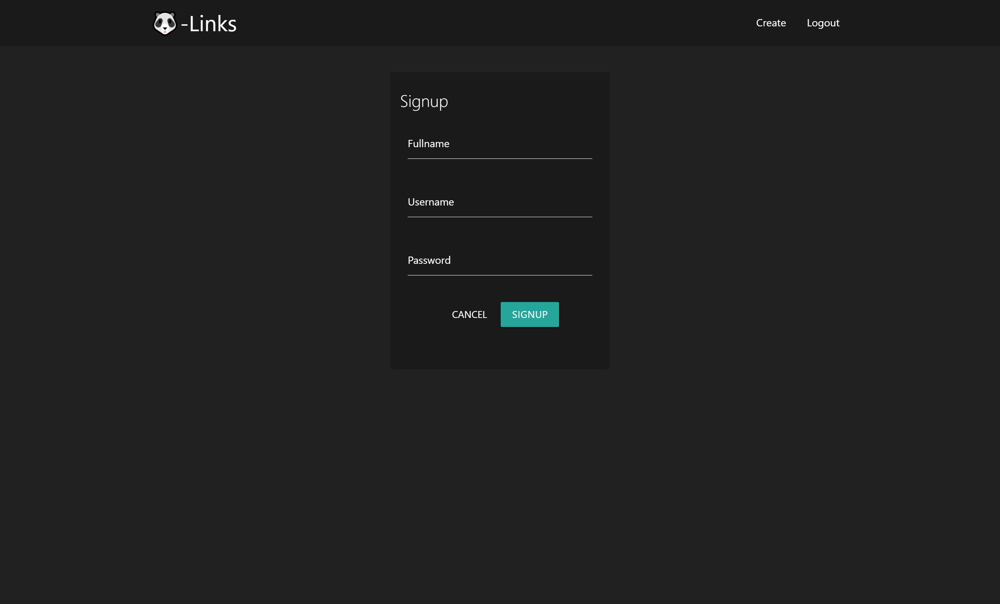
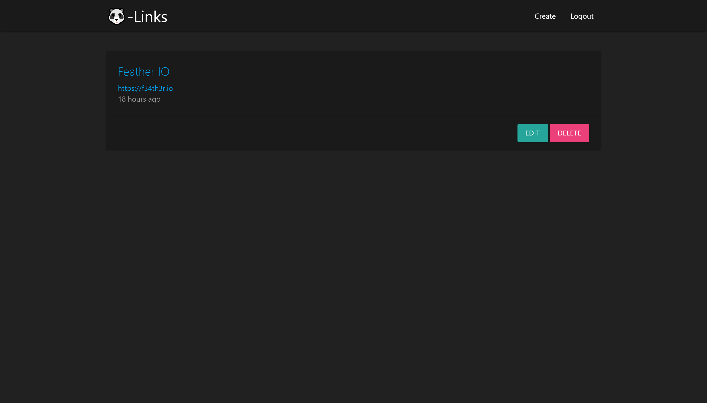
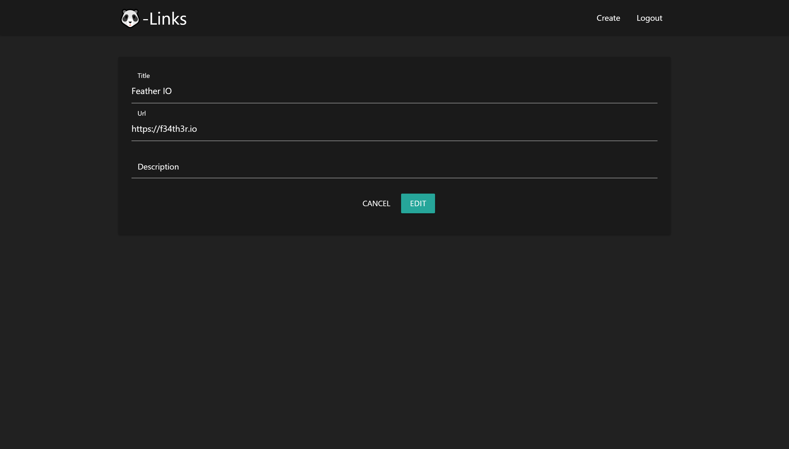

# NodeJs MySQL CRUD and Authentication
It's a simple app to save links.

## Description
CRUD using Node as a back-end and MySQL as a database

### Routes

### **Auth**
```
/signup
```

#### **Links** 
```
/links
/links/add
/links/edit/:id
```

## Setup

### MySQL
```sql
CREATE DATABASE f34th3r_links;

USE f34th3r_links;

-- TABLE USER
-- all pasword wil be encrypted using SHA1
CREATE TABLE users (
  id INT(11) NOT NULL,
  username VARCHAR(16) NOT NULL,
  password VARCHAR(60) NOT NULL,
  fullname VARCHAR(100) NOT NULL
);

ALTER TABLE users
  ADD PRIMARY KEY (id);

ALTER TABLE users
  MODIFY id INT(11) NOT NULL AUTO_INCREMENT, AUTO_INCREMENT = 2;

DESCRIBE users;

INSERT INTO users (id, username, password, fullname) 
  VALUES (1, 'feather', 'secret', 'Feather io');

SELECT * FROM users;

-- LINKS TABLE
CREATE TABLE links (
  id INT(11) NOT NULL,
  title VARCHAR(150) NOT NULL,
  url VARCHAR(255) NOT NULL,
  description TEXT,
  user_id INT(11),
  created_at timestamp NOT NULL DEFAULT current_timestamp,
  CONSTRAINT fk_user FOREIGN KEY(user_id) REFERENCES users(id)
);

ALTER TABLE links
  ADD PRIMARY KEY (id);

ALTER TABLE links
  MODIFY id INT(11) NOT NULL AUTO_INCREMENT, AUTO_INCREMENT = 2;

DESCRIBE links;
```

## Screenshots





